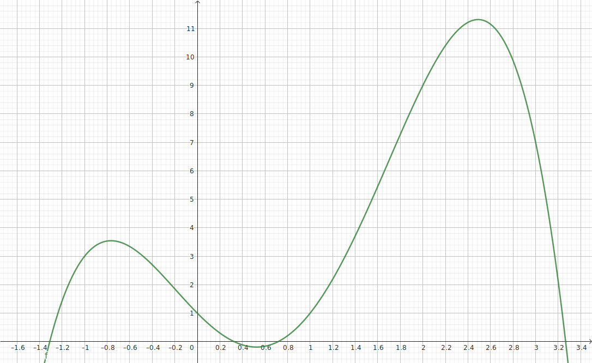

# MMIX-newton
© Andreas Steger 2023

An implementation of a [newton algorithm](https://en.wikipedia.org/wiki/Newton%27s_method) for determining roots of 4th order polynomials implemented in MMIX assembler. The derivative is calculated using a simple [difference quotient](https://en.wikipedia.org/wiki/Difference_quotient).

This program was developed during the _Kleingruppen Übungen_ of the lecture _Grundlagen der modernen Informationstechnologie_ of the winter semester 2023/2024

The documentation is in german.

## Files
`Newton Grafisch.ggb`: graphical drawing of the problem with the parameters used in the program. Open in [GeoGebra](https://geogebra.org/calculator)

`Newton.mms`: The implementation of the algorithm using MMIX assembler (pleas note that the program flow of this implementation isn't ideal, also the naming conventions of register labels are all over the place, please have a look at the version utilizing the stack for a better example)

`Newton_PUSH_POP.mms`: The implementation of the algorithm in MMIX assembler, additionally taking advantage of the integrated stack management of the MMIX.

## Running the code
To run the code you need an MMIX emulator. The [MMIX Visual Debugger](https://www.mmix.cs.hm.edu/mmixvd/help/mmixvd.html) ([download](https://www.mmix.cs.hm.edu/mmixvd/index.html)) is recommended for doing so.

## Further Information
In case you are fluent in german the [_MMIX Buch_](https://link.springer.com/book/10.1007/978-3-642-56233-4) (by Anlauf, Bötcher, Ruckert; ISBN : 978-3-540-42408-6) is, thanks to it's easy and clear descriptions, an excellent starting point. It includes detailed information about the instruction set, gives examples on how to use it and explains the ideas behind their functionality, often by using illustrative diagrams.

Some more information about the MMIX and it's architecture can be found at the official [MMIX Website](https://www.mmix.cs.hm.edu/).

For a deeper dive into the architecture it's [definition](https://www.mmix.cs.hm.edu/doc/fasc1.pdf) might be helpful. 
